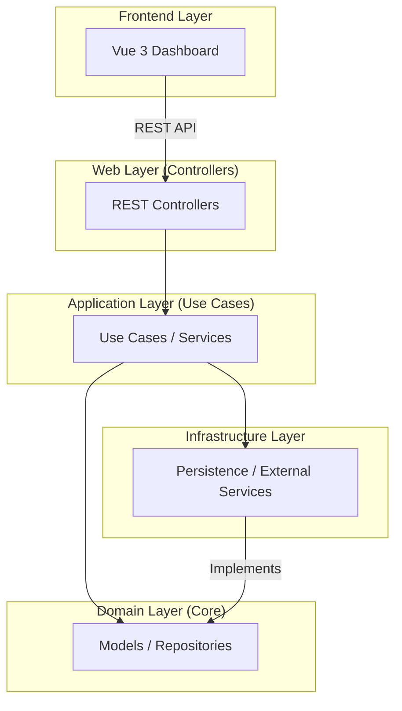

# Project Guide: Auth-as-a-Service

This guide provides a comprehensive overview of the Auth-as-a-Service project, explaining its business value, architecture, authentication flows, and infrastructure.

## Business Value

In today's digital landscape, almost every application needs to manage users and control access to its resources. Building a secure and scalable authentication and authorization system is a complex and time-consuming task. This project provides a ready-to-use, enterprise-grade solution that solves the following problems:

*   **Reduces Development Time:** Instead of building an authentication system from scratch, developers can integrate this service into their applications, saving significant time and effort.
*   **Enhances Security:** The project is built with security best practices in mind, using industry-standard technologies like JWT and TOTP for Multi-Factor Authentication (MFA). This helps protect applications and user data from unauthorized access.
*   **Improves User Experience:** With features like Single Sign-On (SSO), users can log in to multiple applications with a single set of credentials, providing a seamless and convenient experience.
*   **Centralized User Management:** The project provides a central dashboard for managing users, applications, and tenants, making it easy to administer the entire system.
*   **Scalability:** The multi-tenant architecture allows the service to support multiple applications and organizations in a scalable and cost-effective way.

## How it Works: The Big Picture

The project is a classic example of a microservices architecture, with a separate backend for the core authentication logic and a frontend for the administration dashboard.



*   **Frontend (Vue.js):** A single-page application (SPA) that provides a user interface for managing tenants, applications, and users.
*   **Backend (Kotlin/Spring Boot):** A RESTful API that exposes endpoints for authentication, user management, and other core functionalities.
*   **Database (MariaDB):** A relational database for storing tenants, applications, users, and other persistent data.
*   **Cache (Redis):** An in-memory data store for caching frequently accessed data and improving performance.

The backend is built using the principles of **Clean Architecture**, which separates the code into four distinct layers:

The project follows a multi-tenancy model where a `Tenant` can have multiple `Application`s, and each `Application` can have multiple `User`s. This creates a clear hierarchy and ensures that data is properly isolated between different tenants and applications.

*   **Domain:** Contains the core business logic and entities (e.g., `User`, `Tenant`, `Application`).
*   **Application:** Contains the use cases that orchestrate the business logic (e.g., `LoginUseCase`, `CreateTenantUseCase`).
*   **Infrastructure:** Contains the implementation details for external services like the database, cache, and email service.
*   **Web:** Contains the REST controllers that expose the API endpoints.

This separation of concerns makes the code more modular, testable, and maintainable.

## The Authentication Flow

Here's a step-by-step breakdown of how a user authenticates with the service:

1.  **User initiates login:** The user enters their email and password in the frontend application.
2.  **Frontend sends credentials to backend:** The frontend makes a POST request to the `/api/v1/auth/login` endpoint with the user's credentials.
3.  **Backend validates credentials:** The `LoginUseCase` in the backend verifies the user's email and password against the data in the database.
4.  **Backend generates tokens:** If the credentials are valid, the `TokenService` generates a short-lived **access token** and a long-lived **refresh token**.
5.  **Backend returns tokens to frontend:** The backend sends the tokens back to the frontend in the response.
6.  **Frontend stores tokens:** The frontend stores the tokens securely (e.g., in `localStorage` or a cookie).
7.  **Frontend accesses protected resources:** For subsequent requests to protected API endpoints, the frontend includes the access token in the `Authorization` header.
8.  **Backend validates access token:** The `JwtAuthenticationFilter` in the backend intercepts each request, validates the access token, and sets the user's authentication context.
9.  **Backend returns data:** If the access token is valid, the backend processes the request and returns the requested data.
10. **Frontend refreshes access token:** When the access token expires, the frontend uses the refresh token to request a new access token from the `/api/v1/auth/refresh` endpoint, without requiring the user to log in again.

## Single Sign-On (SSO)

The project supports Single Sign-On (SSO), which allows users to log in with their existing accounts from external identity providers like Google, Facebook, or a corporate SAML/OIDC provider.

Here's how the SSO flow works:

1.  **User chooses SSO provider:** In the frontend application, the user clicks on a "Log in with Google" (or similar) button.
2.  **Frontend redirects to SSO provider:** The frontend redirects the user to the login page of the SSO provider.
3.  **User authenticates with SSO provider:** The user enters their credentials on the SSO provider's login page.
4.  **SSO provider redirects back to application:** After successful authentication, the SSO provider redirects the user back to the application's **callback URL** (`/api/v1/auth/sso/callback`), including an **authorization code** or a **token**.
5.  **Backend handles callback:** The `SsoController` in the backend receives the callback and calls the `HandleSSOCallbackUseCase`.
6.  **Backend processes callback:** The `HandleSSOCallbackUseCase` does the following:
    *   Verifies that the SSO provider is enabled for the application.
    *   Exchanges the authorization code for an access token from the SSO provider (if necessary).
    *   Fetches the user's profile information from the SSO provider.
    *   Checks if a user with the same external ID already exists in the database.
    *   If the user exists, it logs them in.
    *   If the user doesn't exist, it creates a new user in the database (Just-In-Time provisioning).
7.  **Backend generates tokens:** The backend generates its own access and refresh tokens for the user.
8.  **Backend returns tokens to frontend:** The backend sends the tokens to the frontend.
9.  **Frontend logs in user:** The frontend receives the tokens and logs the user in, just like a regular login.

## Auditing and Analytics

The application uses an event-driven approach for auditing and analytics. Every important action in the system is recorded as an `Event`. This provides a detailed audit trail of all activities, which is crucial for security and compliance.

The `Event` model captures the following information:

*   **`id`**: A unique identifier for the event.
*   **`applicationId`**: The ID of the application in which the event occurred.
*   **`type`**: The type of event (e.g., `USER_REGISTERED`, `USER_LOGGED_IN`).
*   **`timestamp`**: The time at which the event occurred.
*   **`ipAddress`**: The IP address of the user who triggered the event.
*   **`userAgent`**: The user agent of the user's browser or client.
*   **`metadata`**: A map of additional key-value pairs that provide more context about the event.

The different types of events are defined in the `EventType` enum:

*   **`USER_REGISTERED`**: A new user has registered.
*   **`USER_LOGGED_IN`**: A user has logged in.
*   **`TOKEN_REFRESHED`**: A user has refreshed their access token.
*   **`CLIENT_SECRET_ROTATED`**: An application's client secret has been rotated.

By storing these events, the application can provide real-time analytics on user activity, such as the number of logins, registrations, and active sessions. This information is displayed on the dashboard and can be used to monitor the health and usage of the applications.

## Multi-Factor Authentication (MFA)

The application enhances security by supporting Multi-Factor Authentication (MFA) using Time-based One-Time Passwords (TOTP). This means that in addition to their password, users must provide a second factor of authentication—a time-sensitive code generated by an authenticator app on their smartphone.

The MFA functionality is abstracted through the `MfaService` interface, which defines the core operations for MFA:

*   **`generateSecret()`**: Generates a new secret key for the user.
*   **`getQrCodeUrl()`**: Creates a QR code URL that the user can scan with an authenticator app (like Google Authenticator or Authy) to set up MFA.
*   **`verifyCode()`**: Verifies the 6-digit code provided by the user against the secret key.

The concrete implementation is provided by `TotpMfaService`, which uses the `dev.samstevens:totp` library to handle the complexities of the TOTP algorithm. This service is responsible for:

1.  **Setup:** When a user enables MFA, the service generates a secret and a corresponding QR code. The user scans the QR code, and their authenticator app starts generating codes.
2.  **Verification:** When the user logs in, after entering their password, they are prompted to enter the code from their authenticator app. The service then validates this code to complete the authentication process.

By implementing MFA, the application provides an extra layer of security, making it much harder for unauthorized users to gain access to accounts, even if they have stolen the user's password.

## Security Configuration

The application's security is configured in the `SecurityConfig.kt` file, which uses Spring Security to define the security filter chain. Here are the key aspects of the security configuration:

*   **CORS (Cross-Origin Resource Sharing):** The application is configured to allow requests from any origin (`*`). This is a permissive configuration that is suitable for development, but in a production environment, it should be restricted to only allow requests from the frontend application's domain.
*   **CSRF (Cross-Site Request Forgery):** CSRF protection is disabled. This is a common practice for stateless APIs that use token-based authentication (like JWTs), as they are not vulnerable to CSRF attacks in the same way that traditional session-based applications are.
*   **Session Management:** The session management policy is set to `STATELESS`. This means that the application does not create or use HTTP sessions, which is essential for a scalable, stateless API.
*   **Authorization:** The configuration defines which API endpoints are public and which are protected.
    *   **Public Endpoints:** The endpoints for authentication, SSO, MFA, actuator health checks, and API documentation (Swagger) are all publicly accessible.
    *   **Protected Endpoints:** Any other endpoint requires authentication.
*   **JWT Authentication Filter:** The `JwtAuthenticationFilter` is a custom filter that is executed for every request. It is responsible for:
    1.  Extracting the JWT from the `Authorization` header.
    2.  Validating the JWT's signature and expiration date.
    3.  Extracting the user's identity from the JWT.
    4.  Setting the user's authentication context, which makes the user's information available to the rest of the application.

This security configuration provides a solid foundation for a secure and stateless authentication system.

## JWT Generation and Validation

The application uses JSON Web Tokens (JWTs) for stateless authentication. The `JwtTokenService` is responsible for generating and validating these tokens.

### Token Generation

When a user successfully logs in, the `JwtTokenService` generates two types of tokens:

*   **Access Token:** A short-lived token that is used to authenticate the user for subsequent requests to protected API endpoints.
*   **Refresh Token:** A long-lived token that is used to obtain a new access token when the current one expires.

The `generateToken` method creates the JWTs with the following claims:

*   **`sub` (Subject):** The user's unique ID.
*   **`roles`**: The user's roles (e.g., "USER", "ADMIN").
*   **`applicationId`**: The ID of the application the user is logging into.
*   **`redirectUrl` (optional):** A URL to redirect the user to after a successful login.
*   **`iat` (Issued At):** The time at which the token was issued.
*   **`exp` (Expiration):** The time at which the token expires.

The token is then signed with a secret key using the HMAC-SHA algorithm to ensure its integrity.

### Token Validation

For each incoming request to a protected endpoint, the `JwtAuthenticationFilter` calls the `JwtTokenService` to validate the access token. The validation process involves the following steps:

1.  **Parsing:** The service parses the token string to extract the claims and the signature.
2.  **Signature Verification:** It verifies the token's signature using the same secret key that was used to sign it. This ensures that the token has not been tampered with.
3.  **Expiration Check:** It checks the `exp` claim to ensure that the token has not expired.

If the token is valid, the `JwtAuthenticationFilter` extracts the user's ID from the `sub` claim and uses it to load the user's details from the database. It then sets the user's authentication context, which makes the user's information available to the rest of the application.

## Persistence Layer

The persistence layer is responsible for storing and retrieving data from the database. It uses Spring Data JPA to map the domain models to database entities.

### Domain Models vs. Entities

In a Clean Architecture, it's a common practice to separate the `domain` models from the `persistence` entities.

*   **Domain Models:** These are plain Kotlin data classes that represent the core business objects of the application (e.g., `User`, `Application`, `Tenant`). They are part of the `domain` layer and have no knowledge of the database.
*   **Entities:** These are classes that are annotated with JPA annotations (e.g., `@Entity`, `@Table`) and are mapped to database tables. They are part of the `infrastructure` layer.

This separation allows the domain logic to be independent of the persistence mechanism, which makes the code more modular and testable.

### Example: User and Application Mapping

Here's how the `User` and `Application` domain models are mapped to their corresponding entities:

#### `UserEntity.kt`

```kotlin
@Entity
@Table(name = "users")
class UserEntity(
    @Id
    val id: UUID,

    @ManyToOne
    @JoinColumn(name = "application_id")
    var application: ApplicationEntity,

    // ...
)
```

#### `ApplicationEntity.kt`

```kotlin
@Entity
@Table(name = "applications")
class ApplicationEntity(
    @Id
    val id: UUID,

    @ManyToOne
    @JoinColumn(name = "tenant_id")
    var tenant: TenantEntity,

    // ...
)
```

As you can see, the entities are annotated with JPA annotations to define the table mapping, primary keys, and relationships between entities. For example, the `@ManyToOne` annotation is used to define the relationship between a `UserEntity` and an `ApplicationEntity`, and between an `ApplicationEntity` and a `TenantEntity`.

The repository interfaces in the `domain` layer are implemented in the `infrastructure` layer, where they use these JPA entities to interact with the database. This provides a clear separation of concerns between the business logic and the persistence details.

## Infrastructure and Docker

The project uses Docker and Docker Compose to create a consistent and reproducible development environment. The `docker-compose.yml` file defines the services the backend depends on. This approach makes it incredibly easy for any developer to get the project running without complex manual setup.

### Why use Docker?

*   **Simplified Setup:** Instead of manually installing and configuring MariaDB and Redis on their local machines, developers can simply run `docker-compose up` to start all the required services.
*   **Consistency:** Docker ensures that all developers are using the same versions of the services, which helps to avoid "it works on my machine" problems.
*   **Isolation:** The services run in isolated containers, which prevents them from interfering with other applications on the host machine.
*   **Portability:** The Dockerized environment can be easily deployed to any machine that has Docker installed, making it easy to move the application from development to production.

### The Services

#### MariaDB (Database)

*   A MariaDB container for the relational database.
*   The data is stored in a Docker volume (`mariadb_data`) to ensure that user and application data persists even if the container is removed or restarted.
*   It's exposed on port `3307` on the host machine to avoid conflicts with any default MySQL/MariaDB instances running on port 3306.

#### Redis (In-Memory Cache)

*   **What is it?** Redis is an open-source, in-memory data store. Think of it as a super-fast, temporary database that keeps data in RAM instead of on a hard disk.

*   **Where does it sit?** In this project, Redis runs inside a Docker container on your local machine. It is not an external, paid service. The backend connects to it at `localhost:6379`, as configured in the `application.properties` file.

*   **Is it payable?** No. For this project, you are using the official, free, open-source Redis image from Docker Hub. While there are paid, managed Redis hosting services available from cloud providers (like AWS ElastiCache or Redis Labs), this project uses a local, free version for development.

*   **Why is it used?** The primary purpose of Redis in this project is for **caching**. Accessing data from RAM (Redis) is significantly faster than querying a database that stores data on disk (MariaDB). By caching frequently accessed but infrequently changed data (like application settings, user permissions, or session information), the application can:
    *   **Reduce Database Load:** Fewer queries hit the main MariaDB database.
    *   **Improve Performance:** The application responds much faster for users because it can retrieve data from the cache almost instantly.
    *   **Enhance Scalability:** A fast cache helps the application handle more users and more traffic.
