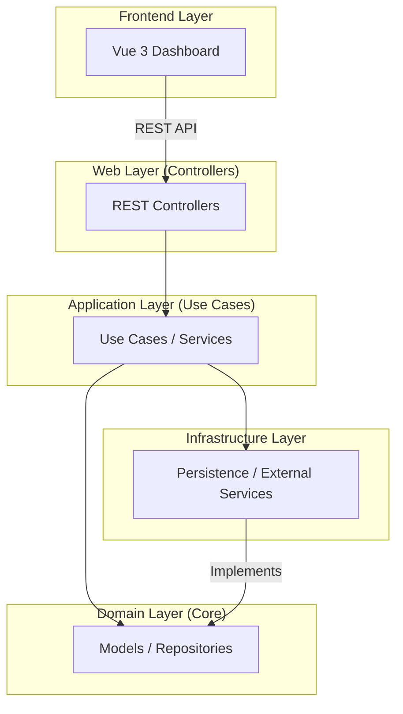

# 🔐 Auth as a Service (AaaS)

> **Enterprise-grade, multi-tenant identity and access management platform.**

AaaS provides a scalable, secure, and developer-friendly solution for managing users, applications, and authentication flows. Built with a modern tech stack and Clean Architecture principles, it offers robust features like Multi-Factor Authentication (MFA), Single Sign-On (SSO), and real-time analytics.

---

## ✨ Key Features

- 🏢 **Multi-Tenancy**: Support for multiple isolated tenants with their own users and applications.
- 📱 **Application Management**: Manage multiple frontend/mobile applications per tenant with unique client credentials.
- 🔒 **Comprehensive Auth**:
    - **MFA (TOTP)**: Secure your users with Time-based One-Time Passwords.
    - **SSO**: Integration with External Identity Providers.
    - **Social Login**: Support for external identity providers.
- 📊 **Real-time Analytics**: Track logins, registrations, and system events with a built-in activity feed.
- 🛡️ **Role-Based Access**: Granular user roles and permissions.
- 📜 **API Documentation**: Interactive Swagger/OpenAPI documentation for easy integration.

---

## 🏗️ Architecture

The project follows **Clean Architecture** and **Domain-Driven Design (DDD)** principles to ensure maintainability and scalability.



---

## 🛠️ Tech Stack

### Backend
- **Language**: [Kotlin](https://kotlinlang.org/)
- **Framework**: [Spring Boot 4.x](https://spring.io/projects/spring-boot)
- **Security**: Spring Security + JWT (jjwt)
- **Database**: MariaDB
- **Cache**: Redis
- **MFA**: [TOTP Library](https://github.com/samstevens/java-totp)
- **API Docs**: SpringDoc OpenAPI / Swagger

### Frontend
- **Framework**: [Vue 3](https://vuejs.org/)
- **Build Tool**: [Vite](https://vitejs.dev/)
- **State Management**: [Pinia](https://pinia.vuejs.org/)
- **Icons**: [Lucide Vue Next](https://lucide.dev/)
- **API Client**: Axios

---

## 🚀 Getting Started

### Prerequisites

Ensure you have the following installed:
- **Java 21+**
- **Node.js 18+**
- **Docker & Docker Compose**
- **Maven 3.9+**

### 1. Launch Infrastructure
Start the database and cache using Docker Compose. 
> [!NOTE]
> MariaDB is mapped to port **3307** to avoid conflicts with local MySQL/MariaDB instances.

```bash
docker-compose up -d
```

### 2. Run the Backend
Navigate to the root directory and start the Spring Boot application:

```bash
./mvnw spring-boot:run
```
- **API Base**: `http://localhost:8080`
- **Swagger UI**: `http://localhost:8080/swagger-ui/index.html`

### 3. Run the Frontend Dashboard
Navigate to the `auth-dashboard` directory and start the development server:

```bash
cd auth-dashboard
npm install
npm run dev
```
- **Dashboard URL**: [http://localhost:5173](http://localhost:5173)

---

## 📂 Project Structure

```text
├── auth-dashboard/         # Vue 3 Dashboard Application
├── src/                    # Backend Source Code
│   ├── main/kotlin/
│   │   └── com/authservice/core/
│   │       ├── application/    # Use Cases and DTOs
│   │       ├── domain/         # Core Models and Business Logic
│   │       ├── infrastructure/ # External Integrations (DB, Redis)
│   │       └── web/           # REST Controllers
├── docker-compose.yml      # Infrastructure Setup
└── pom.xml                 # Maven Configurations
```

---

## 🛡️ Security

AaaS uses JWT (JSON Web Tokens) for stateless authentication. Security configurations are managed via Spring Security, ensuring that all API endpoints are protected based on user roles and tenant context.

---

## 📝 License

This project is licensed under the MIT License - see the LICENSE file for details.